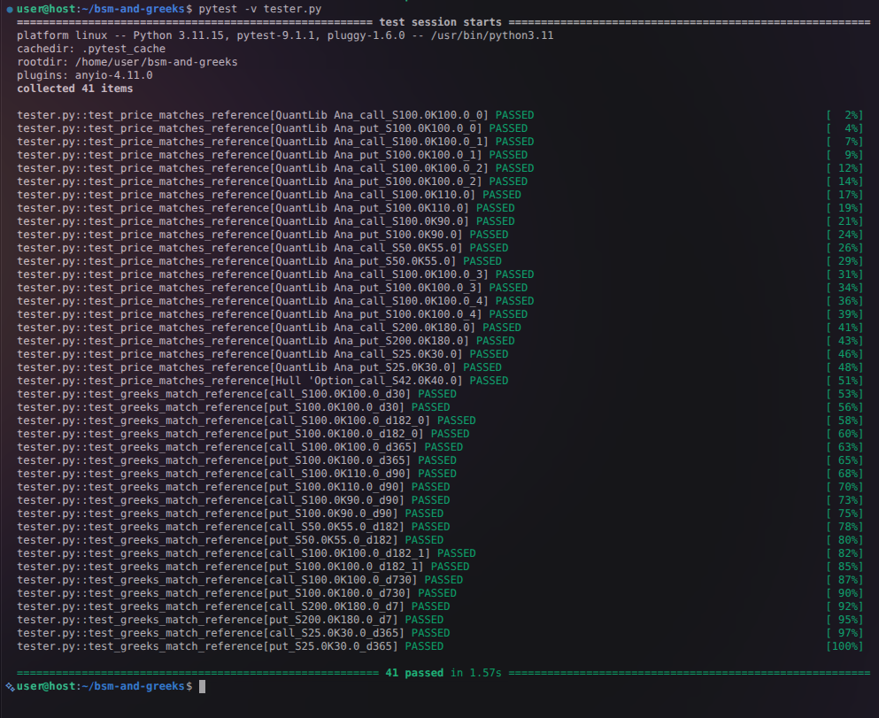

# Black-Scholes-Merton Pricer & Greeks

A readable Python implementation of the **Black-Scholes-Merton
(BSM) model** for pricing European options, plus the **Greeks** 

> **Disclaimer:** This is a learning project for practicing closed-form
> quant finance math in Python, not a production pricing system. It
> covers European options only, assumes constant volatility and
> interest rates, and nothing here should be used to price or hedge
> real trades without your own independent checks.


## Contents

| File | What it's for |
|---|---|
| `european_bsm.py` | Turns option inputs (spot, strike, time, rate, volatility) into a call or put price. |
| `greeks.py` | Calculates the Greeks. Builds on `european_bsm.py`. |
| `tester.py` | Automated tests. Checks that prices and Greeks match an independent reference. |
| `test_data.json` | The reference numbers `tester.py` checks against, generated using QuantLib (an industry-standard pricing library). |
| `generate_test_data.py` | Regenerates `test_data.json`. Only needed if you add new test scenarios. |
| `requirements.txt` | 	Every package this project needs — to run the pricer and to run the tests. |
| `setup_venv.sh` | One command to set up a virtual environment and install everything from requirements.txt |
| `.gitignore` | Keeps the virtual environment and Python cache files out of git. |


## Design Notes

A couple of small choices worth knowing about:

- **One source for the math.** Both the pricer and the Greeks
  depend on the same `d1`/`d2` functions in `european_bsm.py`, rather
  than each recalculating them. That way price and Greeks can't 
  drift apart from each other.
- **Closed-form.** Every value here comes from a direct
  formula so results are
  exact (to floating-point precision) for the model's assumptions.
- **One function per Greek.** Each Greek is its own small, independently
  testable function, plus an `all_greeks()` helper that bundles them.


## Installation

Requires Python 3.9+ (developed on 3.12).

```bash
git clone <this-repo-url>
cd <repo>

bash setup_venv.sh --clean          # creates .venv, installs requirements.txt
source .venv/bin/activate      
```


## Usage

```python
import european_bsm as bs
import greeks as g

params = dict(S=100, K=105, T=0.5, r=0.03, sigma=0.20, q=0.01)

bs.price(**params, option_type="call")   # 3.9657
bs.price(**params, option_type="put")    # 7.9012
bs.put_call_parity_check(**params)       # True

g.delta(**params, option_type="call")    # 0.4173
g.all_greeks(**params, option_type="call")
```

`all_greeks` returns every Greek for one option as a dictionary:

```python
{'delta': 0.4173, 'gamma': 0.0275, 'vega': 27.4931, 'theta': -6.2142,
 'rho': 18.8797, 'vanna': 0.6707, 'volga': 9.6547, 'charm': -0.185}
```

### Inputs:

| Symbol | Argument | Meaning |
|---|---|---|
| $S$ | `S` | Spot price of the underlying |
| $K$ | `K` | Strike price |
| $T$ | `T` | Time to expiry, **in years** |
| $r$ | `r` | Risk-free interest rate (annualised) |
| $\sigma$ | `sigma` | Volatility (annualised) |
| $q$ | `q` | Dividend yield (annualised); defaults to `0.0` |
| | `option_type` | `"call"` or `"put"` |


## Testing

```bash
pytest -v tester.py
```


<div align="center">



</div>

`tester.py` is a data-driven regression test: it loads scenarios from
`test_data.json` and checks that `european_bsm.py` and `greeks.py`
reproduce them.

| Checks | Against |
|---|---|
| Option price | QuantLib's `AnalyticEuropeanEngine` (20 scenarios, calls + puts) |
| Delta, gamma, vega, theta, rho | QuantLib reference values |


To regenerate `test_data.json` after adding a new scenario (in the active venv):

```bash
python generate_test_data.py
```


## Known Limitations

- **European exercise only.** No early-exercise (American) support.
- **Vanna, volga, and charm aren't covered by `tester.py`.** QuantLib's
  basic API doesn't expose those three directly, so they currently have
  no automated check against an independent source. They're implemented
  the same way as the rest of the Greeks, just not test-verified yet.
- **Constant volatility, rate, and dividend yield.** Real markets have a
  volatility smile; this model can't reproduce that.
- **No implied-volatility solver.** You can price *from* a volatility,
  but not back out volatility from a market price, yet.
- **No discrete dividends** — only a continuous yield `q`.


## Roadmap

This is a small project — I might add to it:

- `american_bsm.py` for options with early exercise
- A test for vanna, volga, and charm (e.g. finite-difference checks
  against the pricer, since QuantLib doesn't expose them directly)
- More scenarios in `test_data.json` (different moneyness, maturities, rates)
